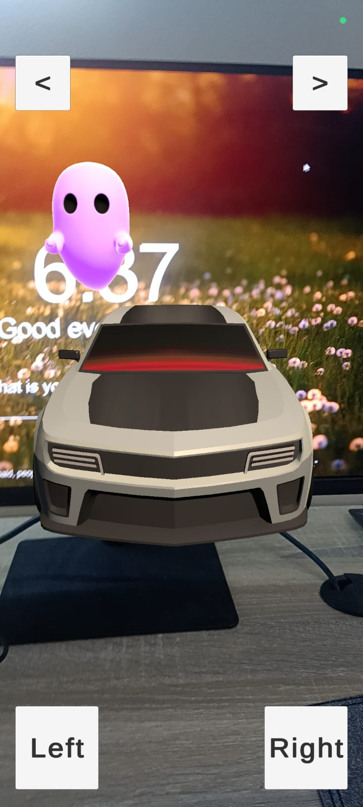
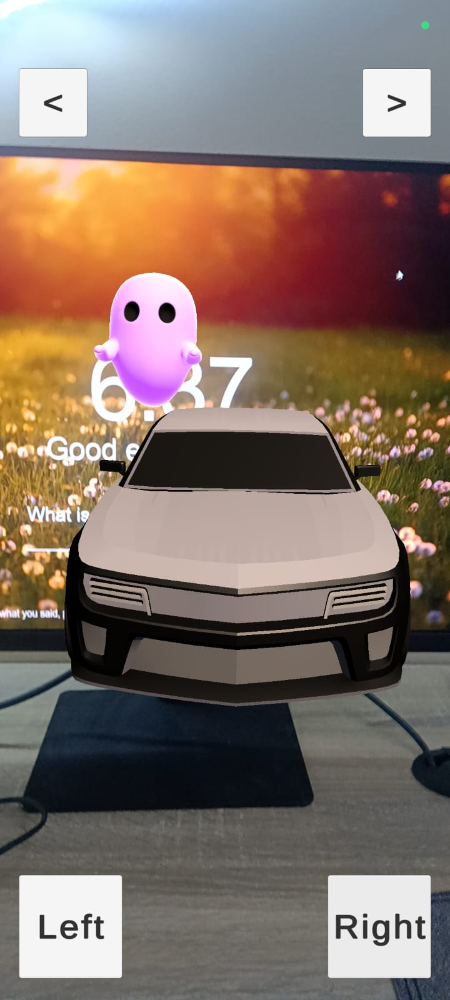
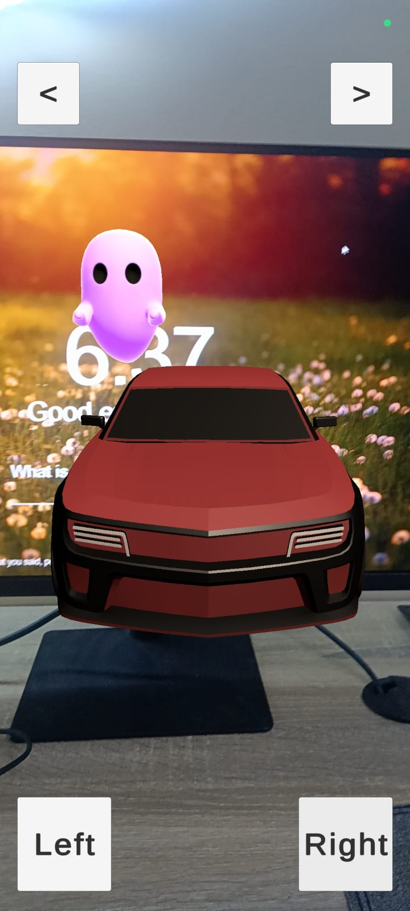
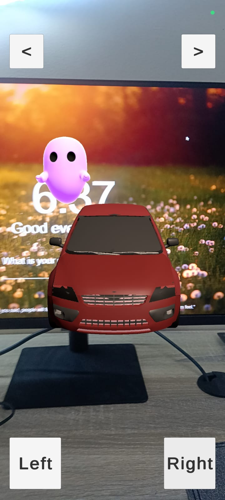
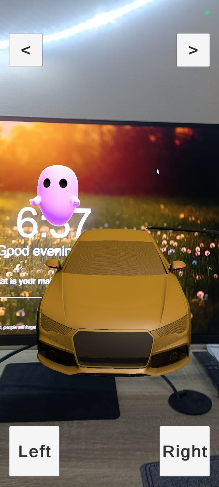
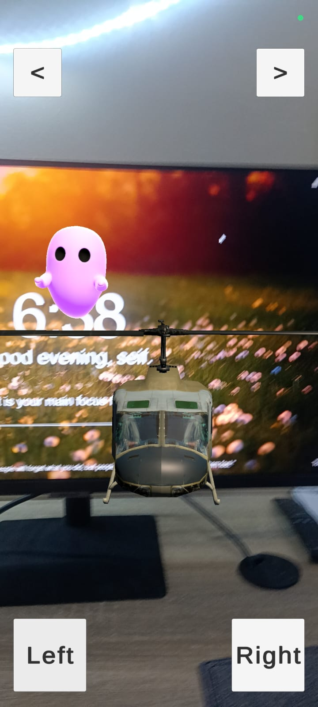
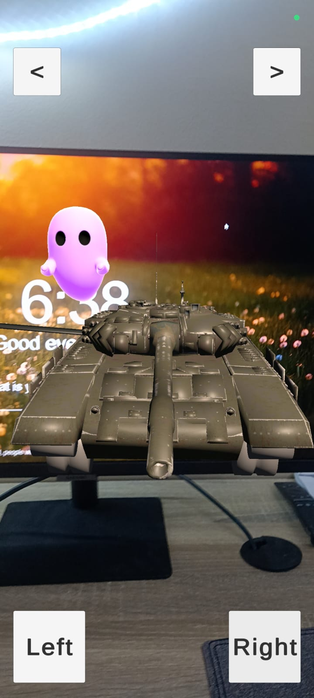

# Augmented Reality Car Showcase and Prefab House View
# Augmented Reality Car Showcase and Prefab House View

  
  
  
  

  
  
    

## Project Overview
The Augmented Reality Car Showcase and Prefab House View project seamlessly integrates Google's AR Core with Unity's visual scripting tools. This repository contains the compiled APK file for an immersive and interactive platform that allows users to explore a curated collection of 3D car models and experience a prefab house view triggered by image recognition.

## Features

- **AR Core Integration:**
  - Robust motion tracking, environmental understanding, and light estimation for enhanced AR experiences.

- **Unity Visual Scripting:**
  - Empowers developers with a no-code/low-code environment for interactive AR scripting.
  - Supports actions like button clicks, variable retrieval, and dynamic object transformations.

- **Interactive 3D Car Models:**
  - Meticulously crafted 3D car models with realistic textures and lifelike proportions.
  - Intuitive user interface for seamless navigation through the virtual showroom.
  - Realism through dynamic placement, adapting to the user's real-world environment.

- **Prefab House View with Image Recognition:**
  - Integration of AR Core's image recognition capabilities to trigger a prefab house view.
  - Seamless overlay of the prefab house upon detecting a specific image.

- **Educational and Marketing Opportunities:**
  - Virtual showroom for exploring and learning about different car designs.
  - Potential for businesses to conduct interactive marketing campaigns.

- **Future Enhancements:**
  - User customization options, real-time lighting effects, and integration with AR glasses.

## Getting Started

### Installation

1. Download the APK file: [[AR_marker_final](AR_seif_app.apk)].
2. Install the APK on an ARCore-supported Android device.

## Usage

1. Launch the app on your device.
2. Explore 3D car models through intuitive gestures.
3. Trigger the prefab house view by scanning a specific image.

## Contributing

Contributions are welcome! Please follow the [CONTRIBUTING.md](CONTRIBUTING.md) guidelines.

## License

This project is licensed under the [MIT License](LICENSE).

## Acknowledgments

- [unity assets, AR core]

## Contact

For inquiries or feedback, please contact [seifbasel] at [seifbasel950@gmail.com].
